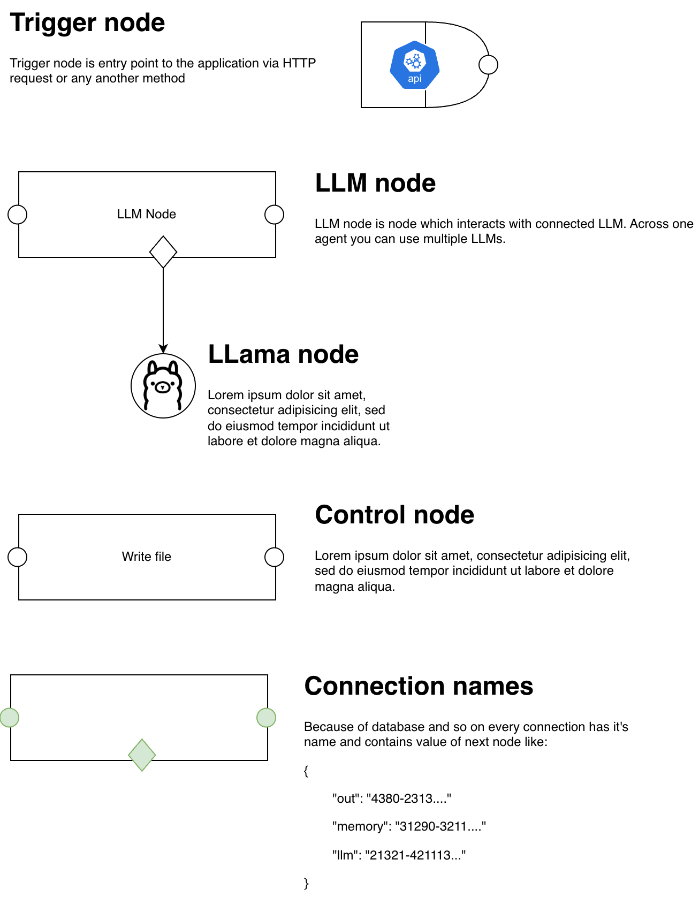

# LLM Package

LLM package contains basic tools and integrate wrappers like langchain for interaction with LLMs.

# Agents

Agent is an entity which is specialized to do certain task. Agent can be triggered by:

- http request
- file change (on local or network disc)
- manual trigger (in UI)
- triggered by system - you can create specialized agents for some kinds automation tools inside the platform, like data analytics and so on

## Agent nodes schema

Following image contains drawio schema and description of nodes and it's types.

